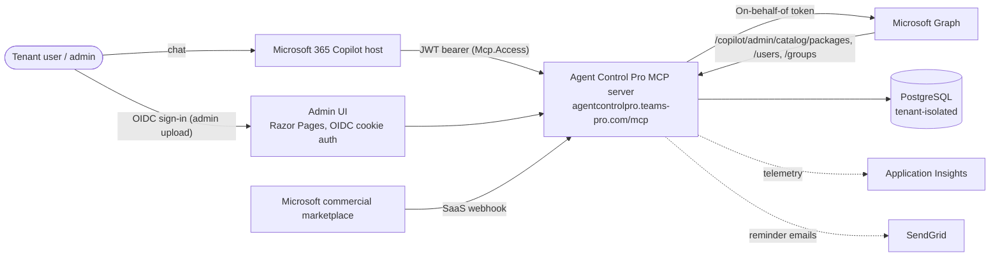

# Agent Control Pro

We understand that our customers need to be confident using Agent Control Pro, and be aware of our data collection practices. Agent Control Pro is a Microsoft 365 Copilot declarative agent that helps administrators discover, classify, and govern Copilot agents in their tenant — with KPIs, duplicate detection, org-wide promotion candidates, and usage analytics sourced from the Copilot usage report.

::: tip Note
This section is subject to change and we recommend that you check back quarterly for updates.
:::

## Data Management Practices

Through the implementation of its different features, Agent Control Pro accesses, processes and stores several kinds of data:

- User profiles
- Tenant identifier (used for tenant isolation)
- Microsoft 365 Copilot agent catalog metadata
- Microsoft 365 Copilot usage report rows (admin-uploaded)
- Marketplace subscription metadata

Here is how we're managing data for these different categories:

| Data | Accessed | Cached | Stored | Backup | Notes |
|------|:--------:|:------:|:------:|:------:|-------|
| User profiles | ✔ | ✔ | 🚫 | 🚫 | Read at sign-in via Microsoft Graph (`User.Read`) and resolved on demand for package access reviews. Not persisted beyond the active session. |
| Tenant identifier (`tid`) | ✔ | ✔ | ✔ | ✔ | Stamped on every record so all queries are filtered by the caller's tenant. Stored as long as the organization is active. |
| Copilot agent catalog metadata | ✔ | 🚫 | 🚫 | 🚫 | Read on demand from `/beta/copilot/admin/catalog/packages`. Returned to the caller; not persisted. |
| User & group directory entries | ✔ | ✔ | 🚫 | 🚫 | Resolved on demand to label package access entries. In-memory cache per request only; never written to durable storage. |
| Copilot usage report rows | ✔ | ✔ | ✔ | ✔ | **Uploaded manually** by an admin as a CSV export of the Microsoft Graph `getMicrosoft365CopilotUsageUserDetail` report. Parsed and stored tenant-isolated in the `Uploads` and `Rows` tables. No automated Graph fetch is performed. |
| Marketplace subscription metadata | ✔ | ✔ | ✔ | ✔ | Received via Microsoft commercial marketplace SaaS webhooks. Stored in the `Subscriptions` table for plan / status tracking. |
| Copilot Conversations | 🚫 | 🚫 | 🚫 | 🚫 | No access. No cache. No storage. |

::: tip No model training
**No customer data is used to train any AI or machine-learning model.** Agent Control Pro only reads from the Microsoft 365 Copilot catalog (via Microsoft Graph) and from admin-uploaded usage reports for governance reporting. No data is sent to any third-party model provider, and no Witivio model is fine-tuned, indexed, or otherwise enriched with customer data.
:::

## Microsoft Graph

::: tip
All permissions are delegated permissions.
:::

| Scope | Description | Justification | Admin Consent Required |
|-------|-------------|---------------|:----------------------:|
| `User.Read` | Retrieve the properties and relationships of the signed-in user. | **Allows Agent Control Pro to read user information for the admin UI and to identify the caller for the on-behalf-of flow.** | No |
| `CopilotSettings-LimitedMode.Read.All` | Read Microsoft 365 Copilot admin catalog settings. | **Used to enumerate the tenant's Copilot agent catalog at `/beta/copilot/admin/catalog/packages` for inventory, duplicate detection, and consolidation analysis.** | Yes |

::: tip
The Microsoft Entra ID App ID is: **0f2c7309-6f93-4362-b4f5-67b7db9856fd**
:::

::: tip Multi-tenant app
The Entra application is multi-tenant. Two Microsoft first-party clients are pre-authorized on the `Mcp.Access` API scope so they can call the Agent Control Pro MCP server on behalf of the user:

- Microsoft 365 Copilot — `ab01d0a1-2a38-4cc0-9a19-9d9dfeea3f76`
- Microsoft Agents Toolkit (Visual Studio Code) — `4345a7b9-9a63-4910-a426-35363201d503`
:::

## Microsoft Graph endpoints

Each Microsoft Graph endpoint that Agent Control Pro calls, the feature it powers, and where in the code the call is issued:

| Endpoint | Purpose |
|----------|---------|
| `GET /beta/copilot/admin/catalog/packages` | List the tenant's Copilot agents. Paginated; up to five pages / one thousand items per call. |
| `GET /v1.0/users/{id}` | Resolve user details for package access reviews. |
| `GET /v1.0/groups/{id}` | Resolve group details for package access reviews. |

All Graph calls are issued with a token acquired via the **on-behalf-of (OBO)** flow from the bearer token presented by Microsoft 365 Copilot — Agent Control Pro never holds an application-only credential against Microsoft Graph and cannot act outside of the calling user's permissions.

## Microsoft Graph limits

In addition, Microsoft Graph applies a token-bucket algorithm based on the complexity of the request. The maximum number of requests applies based [on the number of users in the tenant](https://learn.microsoft.com/en-us/graph/throttling-limits#pattern).

All the limits are available [here](https://learn.microsoft.com/en-us/graph/throttling-limits).

## Architecture and flow diagram

The MCP server validates every Copilot-issued bearer token against the Entra application, then performs an on-behalf-of exchange so all Microsoft Graph requests are scoped to the calling user's delegated permissions. Tenant identity is enforced inside the data layer: every persisted row is stamped with the caller's `tid` claim and every query is automatically filtered by that tenant.

## MCP

Agent Control Pro exposes its capabilities to Microsoft 365 Copilot through a remote **Model Context Protocol (MCP)** server rather than classic REST plugins.

- **Public endpoint:** `https://agentcontrolpro.teams-pro.com/mcp` — HTTPS only.
- **Authentication:** OAuth 2.0 with the custom API scope `Mcp.Access` exposed by Entra application `0f2c7309-6f93-4362-b4f5-67b7db9856fd`. Microsoft 365 Copilot is pre-authorized on this scope and obtains a token on the user's behalf.
- **Tools exposed (six):**
  - `get_agent_analytics` — tenant-level KPIs.
  - `find_similar_agents` — duplicate / overlap detection.
  - `copilot_admin_catalog_GetPackages` — paginated catalog listing with optional OData filter.
  - `copilot_admin_catalog_GetPackageById` — single-package detail lookup.
  - `get_agent_usage` — adoption metrics for a given agent.
  - `list_usage_rows` — paged access to admin-uploaded usage report rows.
- **Data sent to the server:** the caller's bearer token (validated and exchanged via OBO) and tool arguments such as a package id or OData filter expression.
- **Third-party APIs:** none. Tool inputs and Microsoft Graph responses are not retained for model training.

## Resource Endpoints

All the traffic from and to the Agent Control Pro platform uses HTTPS protocol on port 443. Here is a short description of each flow:

| Name | Comments |
|------|----------|
| `agentcontrolpro.teams-pro.com` | Public Agent Control Pro MCP server (`/mcp` endpoint accepts JWT-bearer requests from Microsoft 365 Copilot). The admin Razor Pages UI is also served from this host. |
| `graph.microsoft.com` | Microsoft Graph — Copilot admin catalog, user and group lookups. |
| `login.microsoftonline.com` | Microsoft Entra ID — token acquisition and OpenID Connect sign-in. |
| `*.applicationinsights.azure.com` | Application Insights telemetry (optional). |
| `api.sendgrid.com` | Outbound transactional email — usage-report upload reminders. |
| `marketplaceapi.microsoft.com` | Microsoft commercial marketplace SaaS API — subscription resolve, activate, and status acknowledge. |

<Intercom />
<Hubspot />
<Clarity />
<GoogleAnalytics />
