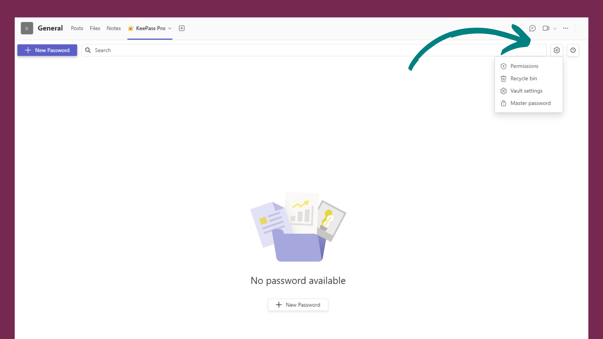

# How to Access KeePass Pro Master Password

## KeePass Pro in a Microsoft Teams Channel

If KeePass Pro is installed in a **channel**, only the owners of the vault can access the master password.

1. Go to the Settings menu and click 'Master Password'.

2. The master password details are displayed. You can show and copy it.

3. Click on 'Close' to go back to your vault.

⚠️ **Warning**: When KeePass is removed, only owners will see the master password in the popup. If the master password is not saved, a user can remove the tab, and it will not be possible to recover it.

## Personal KeePass Pro (Pinned on the Navigation Bar)

Like KeePass in a channel, you can access the master password of your personal vault from the settings menu.
If you remove/uninstall the tab, the next time you reinstall it with the same account, you will get access to it automatically.

<Hubspot />