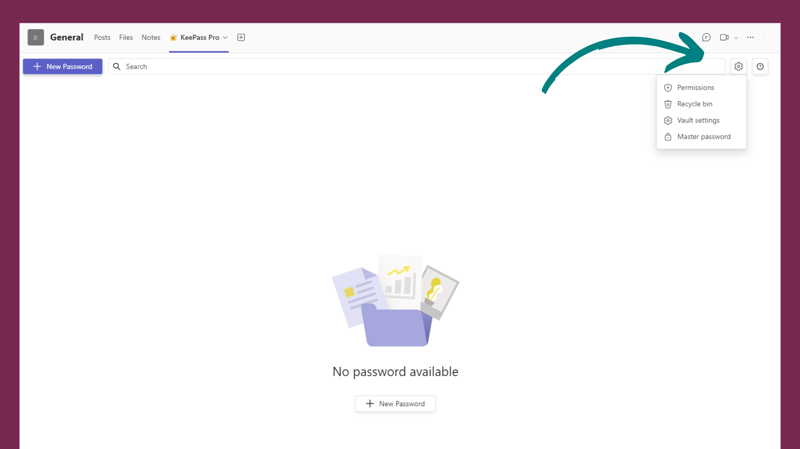
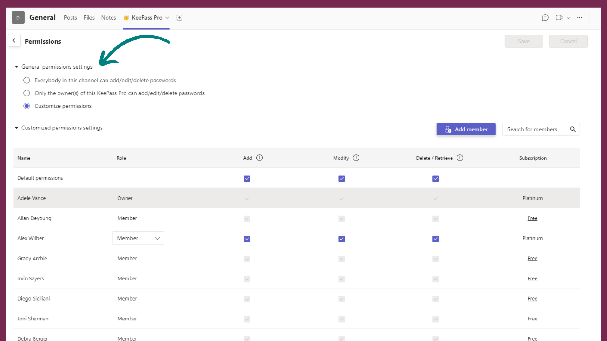
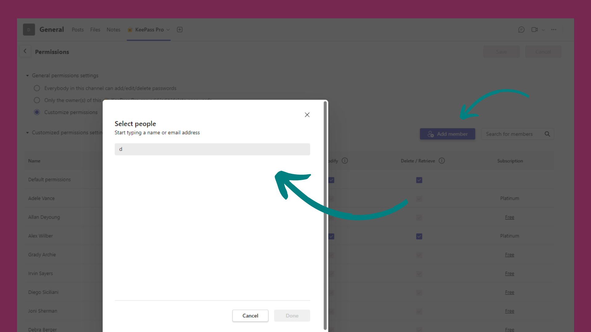
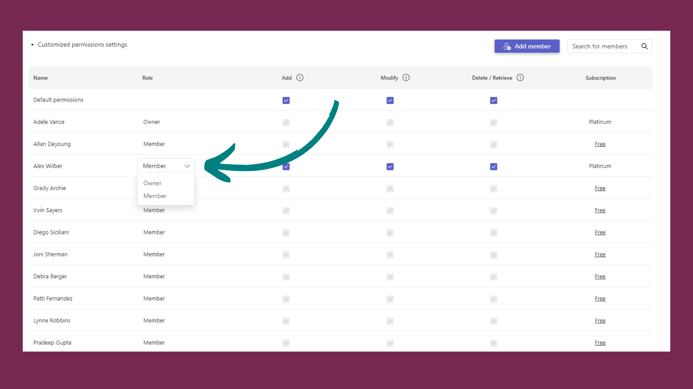

# Managing passwords permissions for IT Team in KeePass Pro

Adele Vance, an IT Manager at a large corporation, needs to manage access permissions for the KeePass Pro app. As the owner of the KeePass Pro tab and with a Platinum license, Adele can customize permissions for team members, ensuring that only authorized personnel can add, edit, or delete passwords. Additionally, Adele can transfer her owner rights to another Platinum user.

1. **Accessing Permissions**:
   - Adele navigates to the KeePass Pro app and clicks on the gear icon at the top right corner of the screen. She selects "Permissions" from the dropdown menu to open the Permissions management window.
   - 

2. **General Permissions Settings**:
   - In the Permissions window, Adele can see the general permissions settings, which offer three options:
     - **Everybody in this channel can add/edit/delete passwords**: This setting allows all members of the channel to manage passwords without restriction.
     - **Only the owner(s) of this KeePass Pro can add/edit/delete passwords**: This setting restricts password management capabilities to the owners of the KeePass Pro workspace.
     - **Customize permissions**: This option allows Adele to tailor specific permissions for each team member. Adele selects "Customize permissions" to proceed, and clicks 'Save'.
   - 

3. **Viewing and Modifying Permissions**:
   - Adele decides to customize permissions for individual team members. The list shows members with their roles and current permissions. Adele grants Alex Wilber the ability to add passwords by checking the corresponding box next to Alex's name under the "Add" column. She can also customize permissions for deleting/retrieving passwords and modifying passwords by checking or unchecking the respective boxes:
     - **Add Passwords**: Allows the user to create new passwords in KeePass Pro.
     - **Modify Passwords**: Allows the user to edit existing passwords.
     - **Delete/Retrieve Passwords**: Allows the user to delete or retrieve from the Recycle Bin passwords.

4. **Adding New Members**:
   - To add a new team member, Adele clicks on the "Add member" button. A search box appears where she starts typing the name or email address of the new member. She selects Debra Berger from the list and clicks 'Done'.
   - 

5. **Giving Owner Rights**:
   - Adele decides to assign owner rights to another Platinum user. She selects the new owner from the list and a confirmation dialog appears warning about the irrevocable rights being granted. Adele reads the message carefully and clicks "Continue" to proceed with the role change.
   - 

6. **Saving Changes**:
   - After making all necessary adjustments, Adele clicks "Save" to apply the new permissions. The changes are now effective, and only those with the appropriate permissions can manage the passwords in KeePass Pro.

<Intercom />
<Clarity />
<GoogleAnalytics />